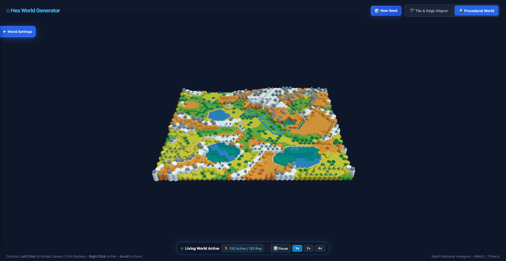
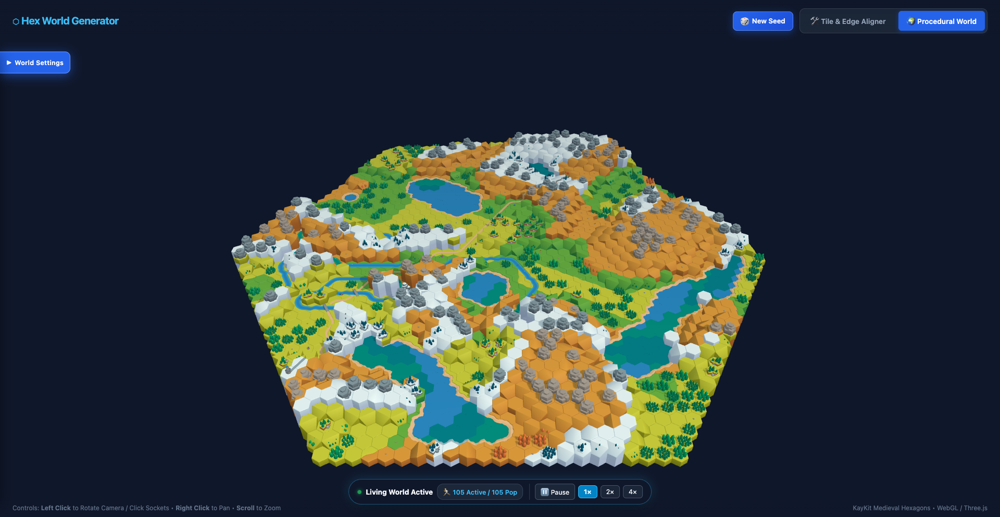
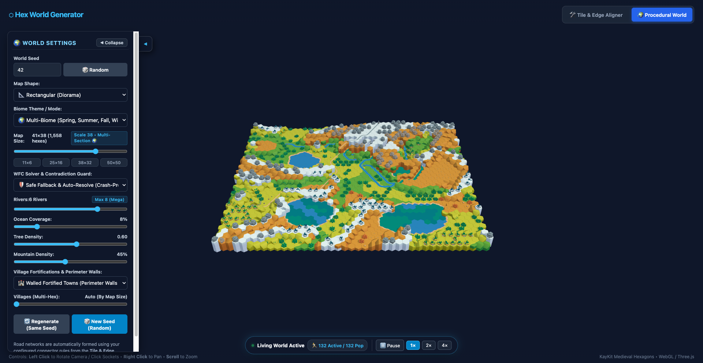

# HexWorldGenerator

> A high-performance, browser-based 3D procedural world generator, living medieval life simulation, and interactive tile aligner built with **Three.js** and the **KayKit Medieval Hexagon** asset pack.

---

## 🖼️ Screenshots

| Daytime Village | River Networks | Dusk / Night |
|---|---|---|
|  |  |  |

---

## ✨ Feature Overview

### 🗺️ Procedural Diorama World Generator
- **Two layout modes**: Hexagonal radial rings and rectangular axial grids, configurable from the sidebar.
- **Multi-octave Simplex elevation** with tiered plateaus, grassy hill mounds, and craggy mountain peaks.
- **Wave Function Collapse coastlines** — 5 coast archetypes (`hex_coast_A`..`E`) with strict zero-defect adjacency rules (no exposed sand cliffs bordering open water).
- **Up to 8 river networks** with natural high-to-low descent, multi-way confluences, waterfalls, estuaries, and automatic road bridges at every crossing.
- **Cohesive faction villages** — each village cluster is assigned one unified palette (`blue`, `red`, `green`, `yellow`) across all buildings, civic structures, and citizen tunics.
  - Civic buildings: `tavern`, `church`, `market`, `blacksmith`, `archeryrange`, `stables`, `well`
  - 80+ authentic fantasy settlement names (*Oakhaven, Silverpeak, Eldermere, Falcon's Rest, …*)
- **Larger towns on big maps** — capitals grow 5–7 hexes, secondary towns 4–6 hexes, hamlets 3–4 hexes on maps >500 hexes.
- **Anti-clipping terrain conformance** — trees are strictly prohibited on sloped hexes and hill mounds; placed exclusively on flat plains.
- **Village slope flattening** — village hexes that would otherwise be sloped are flattened to `hex_grass.fbx` so buildings and units place correctly.
- **Water flora** — lakes and rivers are decorated with water lilies and plants (1–3 per qualifying tile, random sub-hex offsets).
- **Small prop scatter** — `rock_single`, `tree_single`, `barrel`, `crate`, `tent`, and `wheelbarrow` scatter within hex boundaries at radius 0.28–0.35 rather than dead-centre.

### 🧑‍🌾 Living World Simulation Engine
- **Up to 250 active on-screen units**, with overflow population resting in cottages — total kingdom can reach 500+.
- **DOTS columnar architecture** — zero-allocation state updates using contiguous `Float32Array` columnar buffers (`posX`, `posY`, `posZ`, `yaw`, `speed`, `scale`, `actionTimer`).
- **GPU InstancedMesh rendering** — all citizens, heads, carried tools, and domestic animals rendered in **≤ 4 draw calls**.
- **7 dynamic daytime roles**: `merchant`, `sentry`, `miner`, `archer`, `fisherman`, `courier`, `socializer`.
- **Additional professions**: `farmer` (3-stage crop: sow → water → harvest), `lumberjack`, `water_carrier`, `child` (ages and matures), domestic animals (`horse`, `sheep`, `cow`, `pig`).
- **Carried tools per role**: pitchfork, wood axe, pickaxe, bow, fishing rod, water bucket, torch, ale flagon, scroll.
- **Daytime home-rest despawn** — strolling citizens have a 25% chance to walk home and rest for 8–15 s, keeping the active pool naturally below the 250 cap.
- **Activity card accuracy** — the unit inspector shows "heading to Tavern" (etc.) while the unit is still walking, driven by `nextStateOnArrival`.
- **Sentry spread** — sentries use an id-seeded patrol direction + 1–2 hop walks to prevent clustering at a single gate.

### 🌙 24-Hour Celestial Day / Night Cycle
- Continuous orbital lighting: **Dawn (05:00) → Day (08:00) → Dusk (18:00) → Night (21:00)**.
- Dual orbital rig — directional sun light and directional moon light (180° opposite), with smooth cubic lerping of intensities and ambient hemisphere colours.
- **Evening life**:
  - *Dusk*: Workers stow tools and head to the tavern (ale), church (prayer), or village well (socialising).
  - *Night*: Citizens sleep in cottages; sentries patrol gates and walls with burning torches.
- **Interactive celestial dial** — top-right UI widget showing live sun ☀️ / moon 🌙 positions and `HH:MM` time, scrubbable to any time of day.

### 📊 Performance & Telemetry
- **Static Geometry Batching**: Merges static hex tiles, skirts, buildings, walls, and decorations into spatial chunks (`16.0` unit radius) sharing material palettes, reducing draw calls from ~800–1200+ down to **~20–40** (>94% reduction) while preserving physical shadows and raycasting.
- **Frustum Culling**: Spatial chunk bounding spheres enable automatic camera frustum culling via Three.js (up to 70% draw call reduction when zoomed in).
- **Sim tick**: 0.19–0.36 ms per frame (budget: <5 ms) on 50×50 maps with 250 units.
- **Shadow scaling**: disabled on >500-hex maps; 512×512 on 250–500; 1024×1024 on <250.
- **FPS target**: 60 FPS on small maps, 30 FPS on large maps.
- **Rolling 120-frame telemetry** (`perfLogger.js`): avg FPS, min FPS, 1% lows, sim tick latency.
- **Real-time HUD** — top-right `FPS: {nn}` display updated every frame.

### 🎛️ Interactive UI
- **Generation control sidebar** — map size, shape, seed, biome, river count, and regeneration.
- **Kingdom Population Roster** — filterable modal by role chip and live name/profession search; camera tracks any selected unit.
- **Unit inspector card** — shows role, activity, village, and current destination; updates every frame (no stale lag).
- **Animated 3D selection ring** — pulsing ground ring projects under the selected unit.
- **3D Tile & Edge Aligner** (`tileCatalog.js`) — inspect and configure 6-edge socket connectors; changes persist to `tile_registry_config.json`.

---

## 🚀 Quick Start

### Requirements
- **Node.js** v24+
- **Google Chrome** (for headless screenshot capture only)
- No bundler — modules load natively as ES modules in the browser.

### 📦 3D Asset Setup
This project renders medieval procedural worlds using the 3D models and textures from the **KayKit Medieval Hexagon** series. **No 3D asset binaries are distributed within this repository.**

1. Download the free [KayKit Medieval Hexagon Pack](https://kaykit.itch.io/medieval-hexagon-pack) (CC0 Public Domain) by Kay Lousberg on itch.io.
2. Place or link the asset folders into `./kaykit_full/` in the project root:
   ```
   kaykit_full/
   ├── Models/       # FBX files (tiles, buildings, decorations, units)
   └── Textures/     # Texture atlas PNG files (hexagons_medieval.png, etc.)
   ```
   *(Note: `kaykit_full/` is excluded by `.gitignore` to prevent any asset redistribution).*

### 1. Start the Development Server
```bash
node server.js
```
Open [http://localhost:8080](http://localhost:8080) in your browser.

> The server sends `Cache-Control: no-cache` headers to prevent stale JS/FBX assets during development.

### 2. Run All QA Test Suites
```bash
npm run test:all
```
Or run the individual suites directly:
```bash
node tests/test_batching_qa.js && \
node tests/test_world_qa.js && \
node tests/test_living_world_qa.js && \
node tests/test_village_qa.js && \
node tests/test_terrain_elevation_qa.js && \
node tests/test_day_night_qa.js && \
node tests/test_subhex_factions_qa.js
```

All 7 suites must pass at **100% (0 defects)**. See [docs/DEVELOPMENT_AND_QA.md](docs/DEVELOPMENT_AND_QA.md) for suite-by-suite details.

### 3. Capture Headless WebGL Screenshots (Chrome CDP)
```bash
node scripts/capture_qa_screenshot.js --time=12:30 --output=world_day.png
node scripts/capture_qa_screenshot.js --time=19:00 --output=world_dusk.png
node scripts/capture_qa_screenshot.js --time=23:00 --output=world_night.png
```

---

## 🗂️ Project Structure

```
HexWorldGenerator/
├── index.html                   # UI shell — sidebar, HUD, celestial dial, roster modal
├── styles.css                   # Glassmorphic stylesheet & animations
├── main.js                      # Animation loop, camera, UI wiring, subsystem coordination
├── worldGenerator.js            # Procedural world & diorama builder, geometry batcher
├── livingUnitManager.js         # Life simulation, DOTS engine, 7 roles, day/night schedules
├── livingUnitRenderer.js        # GPU InstancedMesh character & animal renderer
├── livingWorldNavMesh.js        # A* pathfinding, hill dome elevation, obstacle solver, POIs
├── dayNightCycle.js             # Celestial cycle, dual orbital rig, interactive dial
├── perfLogger.js                # Float64Array ring-buffer FPS & sim-tick telemetry
├── hexMath.js                   # Axial hex math, sub-hex 6-sector geometry
├── roadAutotile.js              # WFC candidate solver & road autotiling
├── tileRegistry.js              # Connector socket registry & persistence
├── tileCatalog.js               # Interactive 3D Tile Aligner UI
├── assetManifest.js             # 404-model manifest & texture atlas paths
├── server.js                    # Anti-cache Node.js dev server
├── tile_registry_config.json    # Persisted user-validated edge socket tags (authoritative)
├── tests/                       # Automated QA test suites (100% pass rate)
│   ├── test_batching_qa.js      # Static geometry batching & spatial chunking tests
│   ├── test_world_qa.js         # 100-seed WFC / coast / river / road invariant tests
│   ├── test_living_world_qa.js  # 250-unit cap, water exclusion, crop, horse tests
│   ├── test_village_qa.js       # Village cluster sizing & wall solver tests
│   ├── test_terrain_elevation_qa.js # Hill dome elevation & mountain collision tests
│   ├── test_day_night_qa.js     # Celestial phases, evening routines, 7 roles, perf logger
│   ├── test_subhex_factions_qa.js # Sub-hex math, faction colour cohesion, city names
│   ├── test_coast_qa.js         # Coastline WFC invariant tests
│   └── test_large_world_qa.js   # Large world multi-biome section tests
├── scripts/                     # Standalone CLI tools & utilities
│   ├── capture_qa_screenshot.js # Chrome CDP headless WebGL screenshot utility
│   ├── run_browser_perf_benchmark.js # Browser benchmark runner
│   └── unity_asset_tools.py     # Unity package extractor utility
├── tools/                       # Developer inspection tools
│   └── coast_viewer.html        # Standalone 3D coast tile preview tool
├── docs/                        # Specifications & Architecture
│   ├── ARCHITECTURE.md          # Subsystem architecture, DOTS layout, data flow
│   ├── AUTOTILING_SPEC.md       # Hex math, 6-edge indexing, WFC rules
│   ├── BIOMES_AND_TEXTURES.md   # Texture atlas system, biome mapping, faction palettes
│   ├── ASSET_CATALOG.md         # Complete 404-model FBX inventory
│   ├── DEVELOPMENT_AND_QA.md   # Testing protocols, defect criteria, QA suite details
│   └── images/                  # Screenshots & visual QA artifacts
└── kaykit_full/                 # User-provided asset directory (git-ignored, not in repo)
    ├── Models/                  # FBX 3D models (tiles, buildings, units, props)
    └── Textures/                # Shared 1024×1024 texture atlases (Spring/Summer/Fall/Winter)
```

---

## 📐 Architecture at a Glance

```
requestAnimationFrame
  → dayNightCycle.update(dt)          [lighting every 3rd frame, UI every 10th]
  → perfLogger.recordFrame(dt)        [O(1) ring buffer, every frame]
  → livingUnitManager.setTimePhase()  [only on phase change]
  → livingUnitManager.update(dt)      [all activeUnits + resting wakeup pass]
  → livingUnitRenderer.renderUnits()  [InstancedMesh matrix upload, ≤4 draw calls]
  → controls.update()
  → renderer.render()
```

Performance invariants enforced on every frame:
- Sim tick < **5.0 ms** (currently 0.19–0.36 ms)
- Active units ≤ **250**
- Draw calls ≤ **4** for all characters + animals + tools

---

## 📚 Documentation

| Document | Contents |
|---|---|
| [`AGENT_KNOWLEDGE_BASE.md`](AGENT_KNOWLEDGE_BASE.md) | Master reference, system overview, invariants index |
| [`GEMINI.md`](GEMINI.md) | Mandatory engineering rules & performance budgets |
| [`RULES_TILE_TAGGING.md`](RULES_TILE_TAGGING.md) | Edge socket persistence rules |
| [`docs/ARCHITECTURE.md`](docs/ARCHITECTURE.md) | Deep subsystem spec, DOTS memory layout, data flow |
| [`docs/DEVELOPMENT_AND_QA.md`](docs/DEVELOPMENT_AND_QA.md) | QA suite details, defect criteria, dev workflow |
| [`docs/ASSET_CATALOG.md`](docs/ASSET_CATALOG.md) | Complete FBX model & texture inventory |
| [`docs/AUTOTILING_SPEC.md`](docs/AUTOTILING_SPEC.md) | Hex math, 6-edge indexing, WFC constraint rules |
| [`docs/BIOMES_AND_TEXTURES.md`](docs/BIOMES_AND_TEXTURES.md) | Texture atlas system, biome mapping, faction palettes |

---

## ⚖️ License & Assets

- **Source Code**: Dedicated to the public domain under [CC0 1.0 Universal](LICENSE).
- **3D Assets**: [KayKit Medieval Hexagon Pack](https://kaykit.itch.io/medieval-hexagon-pack) by Kay Lousberg — CC0 / Public Domain (external download required; asset pack binaries are not bundled or distributed in this repository).
- **Three.js**: MIT License.
