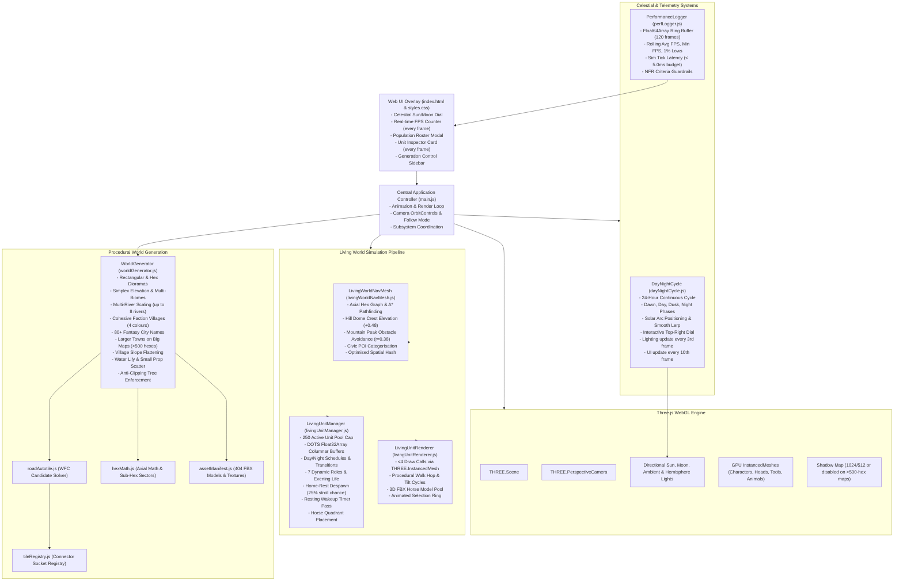

# POC_Kaykit System Architecture

Comprehensive architectural specification, module interactions, data flow, and performance pipelines of the `POC_Kaykit` procedural hex engine and living world simulation.

> **Current milestone**: Milestone 5 — Rivers & Larger Maps  
> **Branch**: `feature/milestone5-rivers-and-larger-maps`

---

## 1. High-Level Architecture Diagram



---

## 2. Animation Loop (Hot Path)

`main.js` lines 116–202:

```
requestAnimationFrame
  → dayNightCycle.update(dt)          [updateLighting every 3rd frame, updateUI every 10th]
  → perfLogger.recordFrame(dt)        [every frame, O(1) Float64Array ring buffer]
  → livingUnitManager.setTimePhase()  [only on celestial phase change]
  → livingUnitManager.update(dt)      [all activeUnits + resting wakeup pass every 4th frame]
  → livingUnitRenderer.renderUnits()  [InstancedMesh matrix upload, ≤4 draw calls]
  → controls.update()
  → renderer.render()
```

**Frame-budget allocation** (50×50 map, 250 units):

| System | Measured cost | Budget |
|---|---|---|
| `livingUnitManager.update()` | 0.19–0.36 ms | < 5.0 ms |
| `livingUnitRenderer.renderUnits()` | ~0.1 ms | — |
| `dayNightCycle.update()` (lighting) | ~0.05 ms every 3rd frame | — |
| `renderer.render()` | GPU-bound | — |

---

## 3. Procedural World Generation (`worldGenerator.js`)

The world generation pipeline constructs stylized 3D hexagonal dioramas with organic topography, hydrological networks, and settlement hierarchies.

### Topography & Biomes
- **Diorama Geometries**:
  - **Hexagonal**: Radial ring expansion up to radius 12+ ($3r(r+1)+1$ cells).
  - **Rectangular**: Centred axial grid with configurable width and height columns/rows.
- **Elevation Synthesis**:
  - Layered Simplex noise with configurable frequency and octaves.
  - Stepped plateaus, hill mounds (`hex_hill.fbx` / `hills_A`), and steep mountain peaks (`hex_rough.fbx` / `rock_A`).
- **Coastline Wave Function Collapse (WFC)**:
  - Land/water boundaries transition through 5 coast archetypes (`hex_coast_A` to `hex_coast_E`).
  - **Strict WFC Invariant**: Sand edges may only meet other sand edges. Sand edges facing open water or void cells trigger automatic constraint backtracking.

### Hydrological Modelling & Confluences
- **Multi-River Scaling**: Up to 8 independent river trajectories originating from highland springs.
- **River Flow Dynamics**: Rivers carve downward using gradient descent towards coastal sea level.
- **Junctions & Confluences**: Merging rivers trigger placement of multi-way river models (`hex_river_D`, `hex_river_I`) where all branch edges are tagged `river`. River edges never terminate into solid grass.
- **Bridges**: Road/river intersections generate aligned bridge pieces (`hex_river_crossing_A`, `hex_river_crossing_B`) that preserve water flow underneath while connecting road networks.

### Village Cluster Sizing (Milestone 5)
- **Large maps (>500 hexes)**: capital 5–7 hexes, secondary town 4–6, hamlets 3–4.
- **Standard maps (≤500 hexes)**: 2–4 hexes.
- Village tiles always have `slope = null` — flattened to `hex_grass.fbx` so buildings and units place correctly.

### Settlements & Factions
- **Cohesive Faction Assignment**: Each village cluster is assigned a unified faction palette:
  - `blue`: Sapphire blue roofs and blue citizen tunics.
  - `red`: Crimson red roofs and red citizen tunics.
  - `green`: Forest green roofs and green citizen tunics.
  - `yellow`: Golden yellow roofs and yellow citizen tunics.
- **Civic Building Roster**: `tavern`, `church`, `market_stall`, `blacksmith`, `archeryrange`, `stables`, `well`.
- **Settlement Naming**: 80+ fantasy settlement name library (e.g. *Oakhaven, Silverpeak, Eldermere, Falcon's Rest*).

### Decoration & Scatter (Milestone 5)
- **Water flora**: `tile.waterLilies[]` array — 1–3 items per qualifying water tile. Shoreline-adjacent: 55% density; open-water interior: 22%. Each item placed at random sub-hex sector, radius 0.18–0.40.
- **Small prop scatter**: `tree_single_A/B`, `rock_single_A–E`, `barrel`, `crate_A_big`, `crate_open`, `tent`, `wheelbarrow` — scatter radius 0.28–0.35 (random sector 0–5).
- **Large props** (mountains, hills, grove clusters) remain centred.

### Anti-Clipping Tree Enforcement
- Slope hexes (`tile.slope`) and hill mounds (`hills_A`) are strictly prohibited from placing vertical tree models.
- Trees are placed exclusively on flat plains (`tile.biome === 'plains' && !tile.slope`).

### Static Geometry Batching & Automatic Frustum Culling (`StaticGeometryBatcher`)
- **Spatial Chunking**: Static world geometry (hex tiles, skirts, buildings, walls, sub-buildings, bridge props, decorations, and water lilies) is partitioned into spatial chunks (`chunkSize = 16.0` world units, ~8-10 hexes across).
- **Material & Shadow Bucketing**: Within each spatial chunk, geometry is grouped by `(chunkKey, biomeTheme, isCastShadow)`. Flat terrain tiles have `castShadow = false`, while elevated buildings, walls, and props have `castShadow = true`.
- **BufferGeometry Merging**: Chunks are merged via `mergeGeometries(geometries, false)` from `three/addons/utils/BufferGeometryUtils.js`. Extraneous attributes are sanitized to `position`, `normal`, `uv`, and geometries are non-indexed.
- **Draw Call Reduction**: Reduces static scene draw calls from **~800–1200+ down to ~20–40** (a >94% reduction).
- **Three.js Frustum Culling**: Each merged chunk mesh computes its `boundingBox` and `boundingSphere`. When the camera zooms in or pans across the diorama, Three.js automatically tests `camera.frustum.intersectsSphere` and culls off-screen chunks, reducing render calls by an additional 50-70%.
- **Zero Simulation Impact**: Pathfinding (`LivingWorldNavMesh`) and unit elevation (`getTerrainHeightAt`) operate on mathematical node graphs and are completely independent of Three.js meshes. Transition tiles (`hex_transition.fbx`) retain their dual-material arrays as individual static meshes.

---

## 4. Living World Simulation

The simulation orchestrates up to 250 on-screen active citizens and wildlife using a Data-Oriented Technology Stack (DOTS) combined with GPU instancing.

### Memory Layout: DOTS Columnar Buffers

To eliminate object allocation overhead and GC stutter during animation-loop updates, citizen simulation states are stored in contiguous `Float32Array` columnar buffers:

```javascript
this.dots = {
  posX:        new Float32Array(maxUnits),  // World X coordinate
  posY:        new Float32Array(maxUnits),  // World Y (terrain-conformant)
  posZ:        new Float32Array(maxUnits),  // World Z coordinate
  yaw:         new Float32Array(maxUnits),  // Heading angle (radians)
  speed:       new Float32Array(maxUnits),  // Movement speed
  scale:       new Float32Array(maxUnits),  // Scale factor (children vs adults)
  actionTimer: new Float32Array(maxUnits),  // Time remaining in current task
  state:       new Uint8Array(maxUnits),    // 0:Idle 1:Walk 2:Work 3:Social 4:Sleep
  role:        new Uint8Array(maxUnits),    // Role ID (0..12)
  flags:       new Uint8Array(maxUnits),    // Bit 0:Active Bit 1:Evening Bit 2:Night
};
```

### 250 Active Unit Pool Cap & Overflow Logic
- Total kingdom population can scale to 500+ citizens across large maps.
- Active on-screen entities are strictly capped at 250 units.
- **Home-rest despawn (Milestone 5)**: During strolling, units have a 25% chance to walk home and set `isResting = true` for 8–15 s, keeping the pool naturally below the cap without hard eviction.
- **Resting wakeup pass**: Every 4th frame, `update()` iterates resting units and revives any whose `restingUntil` timer has expired.
- `u.isResting = true` → unit filtered from `activeUnits` → invisible, sim-frozen.

### Unit State Machine

```
IDLE → WALKING → [
  CHOPPING_WOOD | FETCHING_WATER | HARVESTING_CROP | PLANTING_CROP |
  CULTIVATING_CROP | MINING | FISHING | TRADING | PATROLLING |
  PATROLLING_NIGHT | TAVERN | PRAYING | GATHERING_WELL |
  ARCHERY_PRACTICE | SLEEPING | DELIVERING_* | GRAZING
]
```

**Key state invariants:**
- `routeUnitTo()` path failure → clears `u.tool` + all work flags → sets IDLE (prevents stale "heading to forest" on standing unit).
- `strollAroundVillage()` clears `u.tool` + all flags before routing; 25% chance home-rest.
- `getUnitActivityText()` — when `state === 'WALKING'`, reads `u.nextStateOnArrival` for accurate "heading to X" text.
- `patrolSentry()` uses `(u.id + hop*3 + floor(simTime*0.1)) % neighbors.length` for spread; 1–2 hops per call to prevent gate clustering.

### GPU InstancedMesh Rendering Pipeline
- All entities rendered via `THREE.InstancedMesh` in `livingUnitRenderer.js`.
- Total scene draw calls for all 250 characters, heads, carried tools, and domestic animals: **≤ 4**.
- Per-instance matrix transformations and colour variations updated once per frame in GPU buffers.
- Procedural walk animation: hopping `Math.abs(Math.sin(walkPhase)) * 0.12` and natural body tilt.
- Domestic horses use a dedicated 3D FBX model pool with realistic quadrant-roaming trajectories.

### Navigation Mesh, Elevation & Obstacle Collision (`livingWorldNavMesh.js`)
- **Axial Graph Navigation**: Citizens calculate paths across hexagonal cell networks with localised sub-hex targets.
- **Hill Mound Dome Crest Elevation**:
  $$y_{\text{surface}} = \text{tile.worldY} + 0.48 \cdot \max\left(0, 1.0 - \left(\frac{r}{R}\right)^2\right)$$
  Citizens smoothly climb up and over hill mounds rather than passing through the hill geometry.
- **Mountain Peak Central Obstacle Avoidance**:
  - Mountain peaks register a central obstacle cylinder ($r = 0.38$).
  - Units path around steep peaks via outer hex sectors. Mountain tiles with constructed roads keep the central corridor clear.
- **100% Forest Permeability**: Forest groves permit units to walk beneath the canopy without artificial collision blockage.
- **Sub-Hex 6-Sector Roaming**: Hexagons divided into 6 radial sectors (0..5) + centre. Units select targets across all sectors to prevent clumping at tile centres.
  - Horses are restricted to outer sectors with $r > 0.25$ (perimeter grazing / paddock behaviour).

### The 7 Dynamic Roles & Diurnal Routines
1. `merchant`: Travels between market stalls and town squares, setting up wares and trading.
2. `sentry`: Patrols castle gates, town walls, and perimeter bridges; carries a burning torch at night. Id-seeded patrol direction prevents gate clustering.
3. `miner`: Gathers ore at rocky outcrops, carrying an iron pickaxe.
4. `archer`: Practices at the archery range during day, patrols perimeter towers at dusk.
5. `fisherman`: Casts lines along riverbanks, lakeshores, and docks.
6. `courier`: Runs urgent dispatches between distant villages along paved road highways.
7. `socializer`: Mingles around town squares, village wells, and open-air plazas.

Standard professions: `farmer` (3-stage crop sowing, watering, harvesting), `lumberjack`, `water_carrier`, `child` (runs games and matures), domestic animals (`horse`, `sheep`, `cow`, `pig`).

---

## 5. 24-Hour Celestial Day/Night Engine (`dayNightCycle.js`)

A continuous astronomical simulation drives lighting, shadows, and citizen diurnal schedules.

### Celestial Phases & Time Flow
- Configurable cycle length (default: 120 seconds per in-game 24 hours).
- **Phases**:
  - **Dawn (05:00–08:00)**: Warm peach ambient light, sun rises in the east, workers wake and travel to job sites.
  - **Day (08:00–18:00)**: Bright white sunlight ($1.2\times$ intensity), blue sky hemisphere, active labour.
  - **Dusk (18:00–21:00)**: Deep amber/crimson sunset, long shadows; workers stow tools and head to taverns, church, or the well.
  - **Night (21:00–05:00)**: Deep navy moonlight ($0.25\times$ intensity), stars emerge; citizens sleep in cottages while sentries patrol with torches.

### Dual Orbital Lighting Rig
- Directional sun light rotates along an orbital arc across the celestial dome.
- Directional moon light orbits $180^\circ$ opposite the sun.
- Light intensities and ambient hemisphere colours are smoothly lerped across phase transitions.
- **Frame throttling**: `updateLighting()` runs every 3rd frame; `updateUI()` runs every 10th frame.

### Interactive Sun/Moon Dial Widget
- Positioned in the top-right UI overlay.
- Visualises real-time solar/lunar orbital positions and in-game time (`HH:MM`).
- Clicking or dragging the dial allows instantaneous scrubbing to any time of day.

---

## 6. Performance Telemetry & NFR Guardrails (`perfLogger.js`)

### Telemetry Pipeline
- **Float64Array Ring Buffer (120 frames)**:
  - Computes instantaneous FPS, rolling average FPS, minimum FPS, and 1% lows.
  - Accurately tracks simulation tick latency via `performance.now()` bracketing around `LivingUnitManager.update(dt)`.
- **Top-Right HUD Display**: `FPS: {nn}` in bold white with black outline, updated every frame.

### NFR Invariants
| Metric | Target | Current |
|---|---|---|
| Sim tick latency | < 5.0 ms | 0.19–0.36 ms |
| Active units | ≤ 250 | 200–244 (with home-rest) |
| Draw calls (all entities) | ≤ 4 | 4 |
| Shadow map resolution | 1024 (<250 hex) / 512 (250–500) / disabled (>500) | Per map size |

### Known Limitation
`run_browser_perf_benchmark.js` uses headless Chrome which caps at ~10 FPS due to software-rendered WebGL. These readings are meaningless for FPS measurement — use the in-app FPS counter instead.

---

## 7. Shadow Scaling Policy (Milestone 5)

| Map size | Shadow map | Why |
|---|---|---|
| < 250 hexes | 1024×1024 | Small map, GPU headroom available |
| 250–500 hexes | 512×512 | Balanced quality / performance |
| > 500 hexes | **Disabled** | Largest maps; shadows were single biggest perf cost |

---

## 8. UI, Camera Tracking & Selection Architecture

### Population Roster Modal
- Displays total kingdom demographics, active vs resting population, and village breakdown.
- Filter chips for all roles: `Farmer`, `Lumberjack`, `Merchant`, `Sentry`, `Miner`, `Archer`, `Fisherman`, `Courier`, `Socializer`, `Animals`.
- Live search bar by citizen name or profession.

### Unit Inspector Card
- Updated **every frame** (previously throttled to every 30 frames, causing ~1 s stale lag — fixed in Milestone 5).
- When `state === 'WALKING'`, displays destination ("Heading to Tavern") read from `u.nextStateOnArrival`.

### Camera Follow Mode
- Selecting any unit in the roster or inspector engages isometric camera tracking.
- Smooth lerp damping follows unit position across terrain elevation changes.
- An animated pulsing 3D selection ring projects onto the terrain surface beneath the selected unit.
