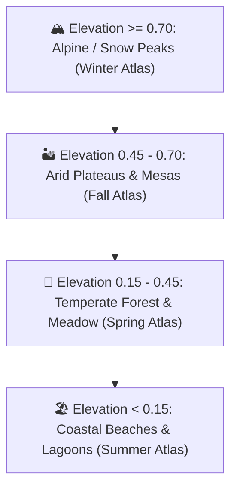

# Seasonal & Environmental Biome System

This document outlines the architecture, visual principles, and implementation rules for the **Biome & Texture Atlas System** in `POC_Kaykit`.

> **Current milestone**: Milestone 5 — Rivers & Larger Maps. All texture, faction, and biome behaviours described here are confirmed operational and passing 100% of QA suites.

---

## 1. Core Principle: Universal UV Palette Mapping

All **404 3D models** in the KayKit Medieval Hexagon Pack (`kaykit_full/Models/`) share an identical, shared UV texture map layout. Every polygon face on every mesh (whether a grass hex, a stone castle tower, a pine tree, a river bank, or a bridge) samples specific coordinate regions from a single 1024x1024 pixel color palette.

Because the UV coordinates are 100% identical across the entire model catalog, swapping the active material texture map transforms the entire scene instantaneously without modifying geometry, vertex buffers, or loading separate 3D files.

---

## 2. Dual Nature: Seasonal Themes AND Environmental Biomes

The pack includes four texture atlases in `kaykit_full/Textures/`. While originally named after the four seasons, **these atlases fundamentally represent geographic and environmental biomes**:

```
kaykit_full/Textures/
├── hexagons_medieval.png        # Default: Spring / Temperate Meadow / Forest Valley
├── hexagons_medieval_Summer.png # Summer / Lush Tropical / Coastal Oasis
├── hexagons_medieval_Fall.png   # Fall / Arid Desert / Mesa / Badlands / Savanna
└── hexagons_medieval_Winter.png # Winter / Alpine Peaks / Glaciers / Tundra
```

### Biome Breakdown & Visual Characteristics

| Texture Atlas | Seasonal Role | Environmental Biome Role | Dominant Palettes & Features |
| :--- | :--- | :--- | :--- |
| **`hexagons_medieval.png`** | **Spring** | **Temperate Valley & Meadows** | Emerald green grass, rich dark loam soils, natural timber wood, red clay shingles. Ideal for low-lying fertile valleys, farmlands, and peaceful villages. |
| **`hexagons_medieval_Summer.png`** | **Summer** | **Tropical Shorelines & Coast** | Warm lime-green foliage, golden sunny sand, sun-bleached stone, vibrant warm roof tiles. Ideal for coastal archipelagos, lakeshores, and sunny plains. |
| **`hexagons_medieval_Fall.png`** | **Fall / Autumn** | **Desert, Mesa, Badlands, Savanna** | Burnt ochre, golden sandstone, terracotta earth, dry arid vegetation, amber leaves. **Instantly turns grass tiles into arid savanna steppes, sandstone desert plateaus, and dusty frontier canyons.** |
| **`hexagons_medieval_Winter.png`** | **Winter** | **High Mountain Peaks, Glaciers, Snow** | Pure alpine white snowdrifts, deep glacial ice blues, frosted stone, snow-capped conifers. **Transforms high-elevation terrain into snow-covered crags, permafrost plateaus, and frozen alpine passes.** |

---

## 3. Multi-Biome Diorama Composition

As demonstrated in reference medieval dioramas, a compelling 3D hex landscape does not need to be restricted to a single monolithic biome. Different biomes naturally coexist across elevation and moisture gradients:



### Implementing Multi-Biome Dioramas in Three.js
Because Three.js materials are assigned per mesh, multi-biome worlds can be rendered via:
1. **Material Sharing by Biome Key**:
   Create 4 shared `MeshPhongMaterial` instances (one per atlas) rather than creating unique materials per mesh:
   ```javascript
   import * as THREE from 'three';
   import { TEXTURE_ATLASES } from './assetManifest.js';

   export class BiomeMaterialManager {
     constructor() {
       this.materials = new Map();
       const loader = new THREE.TextureLoader();
       for (const [biomeKey, path] of Object.entries(TEXTURE_ATLASES)) {
         const tex = loader.load(path);
         tex.colorSpace = THREE.SRGBColorSpace;
         tex.magFilter = THREE.NearestFilter; // Keep clean, sharp pixel/flat-shaded look
         this.materials.set(biomeKey, new THREE.MeshPhongMaterial({
           map: tex,
           shininess: 15,
           specular: 0x222222,
         }));
       }
     }

     getMaterial(biomeKey) {
       return this.materials.get(biomeKey) || this.materials.get('spring');
     }
   }
   ```
2. **Assigning by Elevation or Climate Function**:
   When placing a tile at grid coordinate (q, r) with normalized elevation h in [0, 1]:
   - If h >= 0.75 or tile is a mountain peak -> use `Winter` material (snow peak).
   - If h >= 0.50 and dry -> use `Fall` material (mesa / desert plateau).
   - If near water / river -> use `Spring` or `Summer` material (lush river valley).

---

## 4. Texture Filtering & Lighting Considerations

To preserve the charming, vibrant aesthetic of the KayKit models:
- **Color Space**: Always set `texture.colorSpace = THREE.SRGBColorSpace`. Using Linear sRGB causes colors to appear washed out or muddy.
- **Texture Filtering**: KayKit textures benefit from `texture.magFilter = THREE.NearestFilter` or `THREE.LinearFilter` with mipmapping enabled (`texture.generateMipmaps = true`).
- **Diffuse vs Specular**:
  The FBX files include high specular reflectivity by default (`specular: 0xffffff`). To avoid plastic-like glossiness, set `material.specular.setHex(0x222222)` or use `MeshStandardMaterial` with `roughness: 0.8` and `metalness: 0.1`.

---

## 5. The Transition Tile (`hex_transition.fbx`)

In the KayKit Medieval Hexagon Pack, there is a specialized base terrain tile:
`kaykit_full/Models/tiles/base/hex_transition.fbx`

### Structural Architecture:
- **Geometry & Face Groups**:
  Unlike standard tiles which have a single material slot, `hex_transition.fbx` is split into **2 distinct material groups**:
  - **Slot 0 (`materialIndex: 0`, Material: `hexagons_medieval`)**: Covers approximately half the hex surface (primary biome).
  - **Slot 1 (`materialIndex: 1`, Material: `hexagons_medieval_alt`)**: Covers the opposite half of the hex surface (secondary biome).
- **Purpose**:
  This tile is purpose-built to **split two bordering biomes** across a shared hexagonal boundary (e.g. Winter Snow meeting Spring Grass, or Fall Desert meeting Summer Shoreline).
- **Material Application**:
  When rendering a transition hex between Biome $ and Biome $:
  ```javascript
  const matA = biomeMaterialManager.getMaterial(biomeA);
  const matB = biomeMaterialManager.getMaterial(biomeB);
  transitionMesh.material = [matA, matB];
  ```
  Orienting the tile via 60-degree rotation steps aligns the division line with the border between the two biome regions.

---

## 6. Cohesive Village Faction Palettes & Settlement Naming

To create visually striking, recognizable kingdoms across the diorama, villages are generated with strict faction identity and visual cohesion.

### The Four Faction Palettes
Every multi-hex village is assigned one of four primary realm factions:

| Faction Key | Theme & Colorway | Architectural Styling | Citizen Tunics |
| :--- | :--- | :--- | :--- |
| **`blue`** | **Sapphire / Coastal Realm** | Deep blue slate roof shingles, polished stone trims, blue banners | Royal navy & azure blue linen |
| **`red`** | **Crimson / Highland Stronghold** | Warm crimson clay shingles, iron-reinforced woodwork, crimson banners | Deep ruby & scarlet linen |
| **`green`** | **Emerald / Woodland Province** | Forest green timber roof tiles, mossy stonework, emerald banners | Sage & hunter green wool |
| **`yellow`** | **Amber / Solar Plains** | Golden straw thatch & honey-amber glazed roofs, sun emblems | Mustard & bright golden linen |

### Strict Faction Cohesion Invariant
- **Architectural Cohesion**: Within a village cluster, all residential cottages (`home_A`, `home_B`), civic hubs (`tavern`, `church`, `market`, `blacksmith`, `stables`, `well`), towers, and walls MUST belong to that village's assigned faction colorway. Faction styles are never mixed within a single village.
- **Citizen Attire Cohesion**: Citizens living in or assigned to a village wear tunics corresponding to that village's faction color, providing immediate visual identification from high isometric camera altitudes.

### Authentic Fantasy Settlement Naming Library
Villages receive authentic medieval and fantasy settlement names drawn from an 80+ name registry in `worldGenerator.js`:
- *Highland & Mountain Fortresses*: Oakhaven, Silverpeak, Ironridge, Stonefall, Frostgard, Cragmoor, Stormhold, Winterfell, Ravenwatch.
- *River & Valley Towns*: Riverrun, Eldermere, Willowbend, Clearwater, Millfield, Bridgewall, Mossvale, Fairbrook.
- *Forest & Woodland Settlements*: Pinehurst, Deepwood, Shadowfen, Thornbury, Greenhollow, Briarwood, Sylvan Dale.
- *Coastal Havens & Ports*: Seabreeze, Anchor Point, Driftwood, Coral Cove, Sunken Bay, Port Royal, Pelican Quay.

